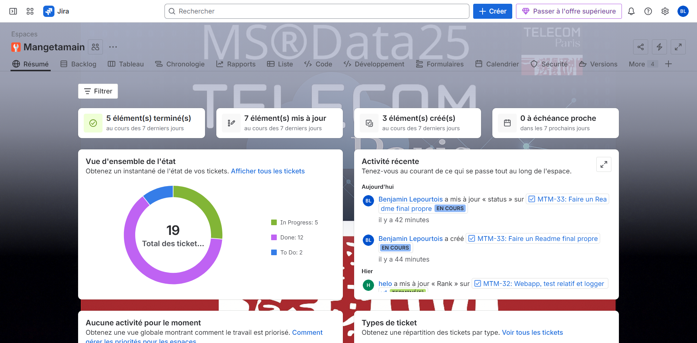

<p align="center">
  
</p>

<h1 align="center">Mangetamain</h1>

<p align="center"><strong>Analyser comment l’effort culinaire façonne la popularité des recettes Food.com</strong></p>

<p align="center">
  
  
  <a href="https://github.com/TelecomParis-MSData25/mangetamain/actions/workflows/ci.yml">
    
  </a>
  
  
  <a href="https://github.com/TelecomParis-MSData25/mangetamain/actions/workflows/dependencies.yml">
    
  </a>
  
</p>

---

## 📊 Aperçu

- `Mangetamain` construit un pipeline de science des données pour relier effort culinaire (temps, étapes, ingrédients) et popularité des recettes (notes, interactions) à partir du dataset Food.com.
- L’application Streamlit (`src/webapp.py`) propose un storytelling interactif, complété par des modules analytiques (`src/`, `dataset_analysis/`) et une documentation Sphinx.
- La chaîne CI/CD GitHub Actions orchestre validation du code, génération de la doc, publication d’images Docker multi-architectures et audit de sécurité.

## 🔬 Problématique & démarche analytique

La question centrale qui guide le projet est : **« En quoi l’effort culinaire influence-t-il la popularité des recettes ? »**

- L’effort est modélisé via `n_steps`, `n_ingredients`, `log_minutes` et des patterns d’effort extraits par nos utilitaires (`src/webapp_utils.py`, `dataset_analysis/`).
- La popularité combine satisfaction (moyenne, médiane, intervalle de confiance des notes) et engagement (volume de reviews, interactions cumulées).
- L’interface permet de croiser ces métriques, d’isoler des familles de recettes et de comparer effort perçu vs. succès rencontré pour aider créateurs et plateformes à prioriser leurs contenus culinaires.

## 👥 Travail collectif & gouvernance

- Projet réalisé en équipe dans le cadre de la formation MSData : les tâches ont été suivies sur Jira.
- Chaque user story Jira déclenche automatiquement la création d’une branche dédiée sur GitHub, ce qui garantit la traçabilité du flux `issue ➜ branche ➜ pull request`.
- Les cérémonies (plannings, revues, rétros) sont consignées dans Jira et synchronisées avec l’historique Git pour documenter les décisions techniques.



*Par défaut, le serveur Jira est accessible à l'adresse suivante : <https://benjaminlepourtois.atlassian.net/jira/software/projects/MTM/boards/3> mais n'est accessible qu'aux membres de l'équipe. Je peux vous fournir un accès si nécessaire.*

---
---

## 🌐 Application en ligne

- L’application Streamlit est déployée sur Streamlit Cloud : <https://mangetamain-ms-data26.streamlit.app/>.
- Le déploiement suit automatiquement les commits de la branche `main` et reflète à la fois les évolutions de l’interface (`src/webapp.py`) et des jeux de données préparés par la CI.
- Les identifiants Kaggle configurés dans GitHub Actions permettent de régénérer les datasets nécessaires à l’instance Cloud pour garantir un rendu cohérent avec l’environnement local.

## 🐳 Images Docker GHCR.io (GitHub Container Registry)

La manière la plus simple d’exécuter l’application est d’utiliser les images Docker publiées automatiquement via la CI/CD GitHub Actions.

- Chaque push sur `main` génère une image publiée sur `ghcr.io/telecomparis-msdata25/mangetamain`.
- Récupération de la dernière version :

  ```bash
  docker pull ghcr.io/telecomparis-msdata25/mangetamain:latest
  docker run --rm -p 8501:8501 ghcr.io/telecomparis-msdata25/mangetamain:latest
  ```

- Pour cibler une version précise, utilisez les tags `:main` ou `:sha-<commit>` visibles dans l’onglet *Packages* du dépôt GitHub.

## 🚀 Démarrage rapide

1. **⚙️ Configurer l'accès Kaggle**

   ```bash
   export KAGGLE_USERNAME="<votre_identifiant_kaggle>"
   export KAGGLE_KEY="<votre_clef_api>"
   ```

   ou bien créer le fichier de configuration attendu par la CLI Kaggle :

   ```bash
   mkdir -p ~/.kaggle
   cat <<'EOF' > ~/.kaggle/kaggle.json
   {"username":"<votre_identifiant_kaggle>","key":"<votre_clef_api>"}
   EOF
   chmod 600 ~/.kaggle/kaggle.json
   ```

   Les identifiants sont disponibles dans votre profil Kaggle > *Settings* > *Create New API Token*. La CI GitHub Actions recharge ces mêmes variables pour télécharger les datasets automatiquement.

2. **📦 Installer les dépendances**

   ```bash
   uv sync --dev
   ```

3. **📊 Préparer les données Food.com**

   ```bash
   uv run python scripts/download_data.py --target data
   uv run python dataset_analysis/dataset_preprocessing.py
   ```

4. **📱 Lancer le tableau de bord Streamlit**

   ```bash
   uv run streamlit run src/webapp.py
   ```

Les notebooks dans `dataset_analysis/` et `src/data_analysis.py` illustrent les étapes de préparation, d’ingénierie de variables et de modélisation.

## ⚙️ Chaîne CI/CD

La pipeline principale (`.github/workflows/ci.yml`) s’exécute à chaque push et se décline en plusieurs stages :

- **PR Checks** : linting Ruff, synchronisation `uv`, téléchargement automatisé du dataset Kaggle, tests Pytest avec couverture et build Sphinx.
- **Main Pipeline** : répète les validations, publie les rapports de couverture HTML et des artefacts de tests.
- **Build Docs** : recompile la documentation Sphinx et la prépare pour GitHub Pages.
- **Deploy Docs** : déploie automatiquement la documentation sur la branche GitHub Pages du projet.
- **Build & Push Docker** : publie des images multi-architectures (`linux/amd64`, `linux/arm64`) sur GHCR avec des tags `latest`, `main`, `sha`.
- **Security Scan** : exécute Trivy pour remonter les vulnérabilités dans l’onglet *Security*.

Une seconde pipeline (`.github/workflows/dependencies.yml`) tourne chaque lundi pour :

- Mettre à jour automatiquement le lockfile `uv.lock` et ouvrir une PR dédiée si nécessaire.
- Lancer un audit de sécurité (Safety, Bandit) et archiver les rapports.

## 📚 Documentation

- Documentation API et guide utilisateur publiés automatiquement sur GitHub Pages : <https://telecomparis-msdata25.github.io/mangetamain/>.
- Lancement local :

```bash
uv run sphinx-apidoc -o docs/source ../src --force
uv run sphinx-build -b html docs/source docs/build/html
open docs/build/html/index.html  # ou xdg-open sous Linux
```

## 📈 Jeux de données & pipeline analytique

- Le dataset Food.com est téléchargé via la CLI Kaggle (automatisé dans la CI et via `scripts/download_data.py`).
- `dataset_analysis/dataset_preprocessing.py` assemble les jeux d’entraînement : nettoyage des ingrédients, agrégation des interactions, enrichissement temporel.
- Les features sont persistées dans `data/` et `ingr_map.pkl` pour réutilisation par la webapp et les notebooks.

## 🧪 Tests & qualité logicielle

- **Linting** : `uv run ruff check src tests scripts`.
- **Tests unitaires & intégration** : `uv run pytest -v`.
- **Couverture** : `uv run pytest --cov=src --cov-report=term-missing --cov-report=html`.
- **Sécurité locale** (optionnel) : `uv run safety check`, `uv run bandit -r src`.

Les rapports HTML sont générés dans `htmlcov/`, et la CI publie les mêmes artefacts pour chaque exécution.

## 📁 Structure du dépôt

```text
.
├── src/                 # Modules applicatifs, webapp Streamlit, utilitaires d'analyse
├── dataset_analysis/    # Préparation des données et notebooks explicatifs
├── scripts/             # Outillage (téléchargement Kaggle, maintenance)
├── docs/                # Documentation Sphinx (source & build)
├── tests/               # Suite Pytest (unitaires, intégration, webapp)
└── assets/              # Identité visuelle (logo, illustrations)
```

---

Vous pouvez suivre l’avancement, les user stories et les décisions d’équipe directement depuis Jira et GitHub pour retracer l’intégralité du projet Mangetamain.
