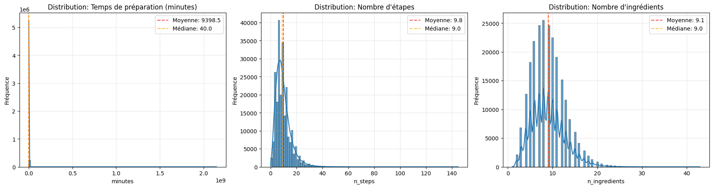
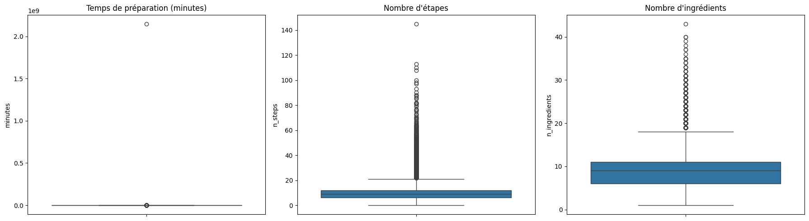
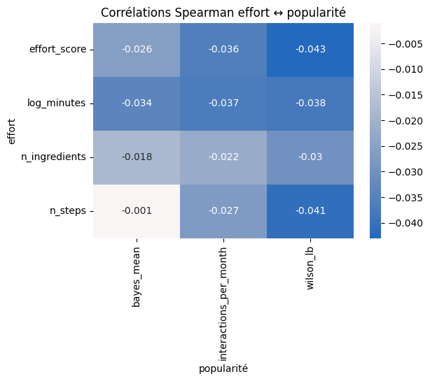
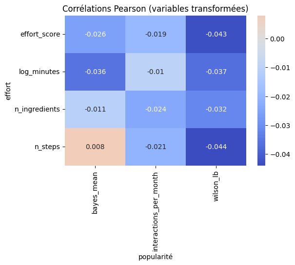
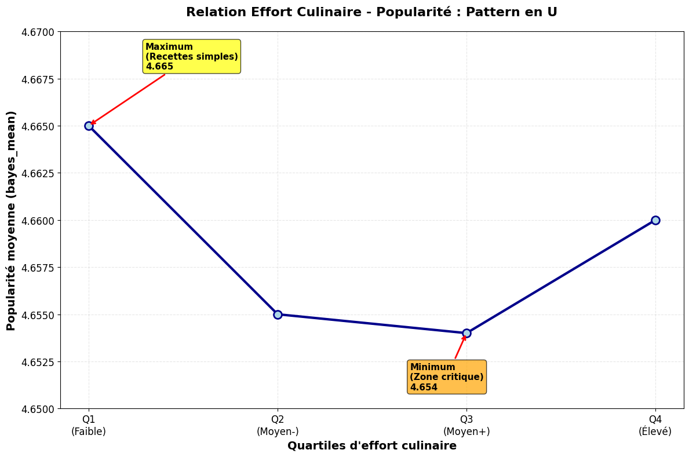

# Rapport d'Analyse : Influence de l'Effort Culinaire sur la Popularité des Recettes

## Introduction

Cette étude vise à analyser la relation entre l'effort culinaire requis pour réaliser une recette et sa popularité auprès des utilisateurs. L'analyse s'appuie sur un dataset de recettes culinaires comprenant des informations techniques (temps de préparation, nombre d'étapes, ingrédients) et des métriques de popularité (notes, interactions utilisateur).

**Problématique** : L'effort culinaire influence-t-il la popularité des recettes ? Les recettes complexes sont-elles moins populaires que les recettes simples ?

## 1. Exploration des Données

### 1.1 Données d'origine et typologie des variables

Le dataset initial (`RAW_recipes.csv`) contient plus de 230 000 recettes avec les variables suivantes :

**Variables quantitatives continues** :

- `minutes` : temps de préparation en minutes
- `n_steps` : nombre d'étapes de préparation (discrète)
- `n_ingredients` : nombre d'ingrédients (discrète)

**Variables textuelles** :

- `steps` : description détaillée des étapes de préparation
- `ingredients` : liste des ingrédients

**Variables d'identification** :

- `id` : identifiant unique de la recette

### 1.2 Justification du choix des variables

Ces variables ont été sélectionnées car elles constituent les composantes fondamentales de l'effort culinaire :

- **Temps** : contrainte temporelle directe pour l'utilisateur
- **Complexité procédurale** : effort cognitif et technique requis
- **Ressources** : effort logistique de préparation des ingrédients

### 1.3 Observation des distributions et taille des bins

L'exploration des distributions révèle des asymétries importantes :

- `minutes` : distribution très asymétrique avec de nombreux outliers (recettes > 1000 minutes)
- `n_steps` : distribution concentrée entre 1 et 20 étapes, quelques valeurs extrêmes
- `n_ingredients` : majorité des recettes entre 5 et 15 ingrédients

Pour la visualisation, la règle de Freedman-Diaconis a été appliquée pour déterminer la taille optimale des bins :

$$\text{largeur\_bin} = \frac{2 \times \text{IQR}(x)}{n^{1/3}}$$

Cette approche garantit une représentation visuelle équilibrée des distributions asymétriques.

Les histogrammes révèlent clairement les asymétries mentionnées, justifiant les transformations logarithmiques appliquées par la suite.

Les boxplots confirment la présence d'outliers extrêmes, particulièrement pour la variable `minutes` avec des recettes dépassant 1000 minutes.

## 2. Prétraitement des Données

### 2.1 Traitement des outliers

Plusieurs stratégies ont été appliquées selon les variables :

**Pour `minutes`** :

- Identification d'outliers extrêmes (recettes > 360 minutes soit 6h)
- Suppression de ces recettes car des recettes aussi longues n'impliquent pas nécessairement un effort culinaire important
- Application d'une transformation logarithmique : `log_minutes = log(minutes + 1)`
- Winsorisation au 95e percentile pour les analyses de corrélation

**Pour `n_steps`** :

- Identification des outliers qui ne traduisent pas un effort plus ou moins extrême, certaines recettes ont beaucoup d'étapes avec très peu de mots donc peu d'effort
- Conceptualisation d'une nouvelle variable qui traduirait au mieux l'effort en calculant le nombre de mots moyen par étape afin de pondérer la variable `n_steps`.

**Pour `n_ingredients`** :

- Conservation des valeurs extrêmes car elles représentent des recettes réellement complexes
- Transformation logarithmique pour `n_ingredients` dans certaines analyses

### 2.2 Suppression des valeurs NULL/NAN

- Variables techniques : aucune valeur manquante dans le dataset initial
- Variables de popularité : suppression de 4 751 recettes sans notes numériques
- Variables d'effort : suppression de 1 094 recettes de 0 minute et de 8 729 recettes de plus de 6 heures.
- Dataset final : 221 813 recettes avec données complètes

### 2.3 Création de variables (Feature Engineering)

**Variables transformées** :

- `log_minutes` : transformation logarithmique du temps (quantitative continue)
- `log_n_ingredients` : transformation logarithmique du nombre d'ingrédients
- `log1p_interactions_per_month_w` : interactions mensuelles avec transformation log1p et winsorisation

**Variables dérivées** :

- `avg_words_per_step` : complexité textuelle des instructions (quantitative continue)
- `effort_score` : score composite d'effort (0-100, quantitative continue)
- `effort_category` : catégorisation de l'effort (qualitative ordinale : "Très Facile", "Facile", "Modéré", "Difficile", "Très Difficile")
- `effort_quartile` : quartiles d'effort (qualitative ordinale)
- `steps_x_ingredients` : terme d'interaction (quantitative continue)

**Variables de popularité** :

- `bayes_mean` : score de qualité bayésien (quantitative continue)
- `wilson_lb` : borne inférieure de Wilson pour la confiance (quantitative continue)
- `interactions_per_month` : engagement mensuel des utilisateurs (quantitative continue)

**Calcul du score d'effort composite** :

$$\text{effort\_score} = 0.40 \times \text{minutes\_score} + 0.35 \times \text{avg\_words\_per\_steps\_score} + 0.25 \times \text{ingredients\_score}$$

Avec normalisation Min-Max sur échelle 0-100.

### 2.4 Variables utilisées pour l'analyse bivariée

**Variables d'effort** (utilisées concrètement) :

- `log_minutes` : temps transformé
- `avg_words_per_steps` : nombre moyen de mots par étape
- `n_ingredients` : nombre d'ingrédients  
- `effort_score` : score composite

**Variables de popularité** (utilisées concrètement) :

- `bayes_mean` : qualité perçue
- `wilson_lb` : confiance statistique
- `interactions_per_month` : engagement utilisateur

## 3. Analyses de la Popularité en Fonction de l'Effort

### 3.1 Analyses de corrélation

**Corrélation de Spearman (non-paramétrique)** :
Utilisée pour sa robustesse aux distributions asymétriques, appliquée sur les variables brutes.

Résultats principaux :

- `effort_score` vs `bayes_mean` : ρ = -0.026 (p < 0.001)
- `effort_score` vs `wilson_lb` : ρ = -0.043 (p < 0.001)
- `log_minutes` vs `interactions_per_month` : ρ = -0.037 (p < 0.001)

**Corrélation de Pearson (paramétrique)** :
Appliquée sur variables transformées pour respecter les hypothèses de normalité.

Mapping des transformations :

- `n_ingredients` → `log_n_ingredients`
- `interactions_per_month` → `log1p_interactions_per_month_w`

Résultats cohérents avec Spearman, confirmant la robustesse des conclusions.

| Corrélations de Spearman | Corrélations de Pearson |
|:------------------------:|:-----------------------:|
|  |  |
| *Variables brutes* | *Variables transformées* |

La heatmap révèle des corrélations très faibles (toutes < |0.05|) entre les variables d'effort et de popularité, avec une légère tendance négative suggérant que l'effort n'améliore pas la popularité.

### 3.2 Analyse par quartiles avec tests ANOVA

**Méthodologie** :

- Division des recettes en 4 quartiles d'effort égaux
- Comparaison des moyennes de popularité entre groupes
- Tests ANOVA et Kruskal-Wallis pour vérifier les différences

**Résultats** :

| Quartile d'effort    | Popularité moyenne (bayes_mean) |
|----------------------|---------------------------------|
| Q1 (Faible)          | 4.665 ± 0.105                   |
| Q2 (Moyen-)          | 4.655 ± 0.108                   |
| Q3 (Moyen+)          | 4.654 ± 0.105                   |
| Q4 (Élevé)           | 4.660 ± 0.102                   |

**Tests statistiques** :

- ANOVA : F = 119.973, p < 0.001 (significatif)
- Kruskal-Wallis : H élevé, p < 0.001 (significatif)

**Pattern en U observé** : Les recettes très simples (Q1) et très complexes (Q4) sont légèrement plus populaires que les recettes d'effort moyen.

Le graphique illustre le pattern en U détecté : bien que statistiquement significatif, l'amplitude de variation (0.011 point) reste pratiquement négligeable, confirmant que l'effort n'a pas d'impact substantiel sur la popularité.

### 3.3 Analyses de régression linéaire

**Modèles univariés** :

- `effort_score` → `bayes_mean` : R² = 0.001 (0.1% de variance expliquée)
- Coefficient = -0.0003 (impact négligeable)

**Modèles multivariés** :
Variables prédictives standardisées : `log_minutes_std`, `n_steps_std`, `n_ingredients_std`, `steps_x_ingredients_std`, `age_months_std`

Résultats pour les trois cibles :

- `bayes_mean` : R² = 0.002, coefficients < ±0.02
- `wilson_lb` : R² = 0.002, coefficients < ±0.02  
- `log1p_interactions_per_month_w` : R² = 0.003, coefficients < ±0.02

**Interaction `steps_x_ingredients`** :

- Effet statistiquement significatif mais pratiquement négligeable
- Coefficient ≈ -0.001 pour `wilson_lb` et engagement

### 3.4 Analyses non-linéaires (LOWESS)

**Régression LOWESS** appliquée pour détecter des relations non-linéaires :

- `log_minutes` vs `bayes_mean` : courbe quasi-plate autour de 4.65
- `effort_score` vs `interactions_per_month` : légère décroissance sans courbure marquée
- Pas d'effet de seuil ni de relation en U détectée

**Interaction spatiale** `n_steps` × `n_ingredients` :

- Densité maximale dans la zone effort modéré (< 20 étapes, < 15 ingrédients)
- Coloration homogène par `bayes_mean` : pas de "hotspots" de satisfaction
- Recettes très complexes : densité faible, popularité non améliorée

### 3.5 Pourquoi plusieurs analyses

Chaque méthode apporte une perspective complémentaire :

1. **Corrélations** : Vue d'ensemble des relations linéaires/monotones
2. **Tests par groupes** : Détection d'effets de seuil et relations discrètes
3. **Régression** : Quantification des effets et contrôle des variables confondantes
4. **LOWESS** : Exploration des non-linéarités sans hypothèse paramétrique
5. **Modèles multivariés** : Décomposition des effets individuels vs interactions

Cette approche multi-méthodologique garantit la robustesse des conclusions face aux distributions asymétriques et aux possibles non-linéarités.

## 4. Conclusion

### 4.1 Résumé des résultats concluants

**Consensus statistique** : Toutes les analyses convergent vers une conclusion robuste :

- Corrélations systématiquement < |0.05| entre effort et popularité
- R² des modèles prédictifs < 0.01 (variance expliquée négligeable)
- Tests ANOVA significatifs mais différences pratiques minimes (< 0.02 point)
- Absence de non-linéarités marquées (courbes LOWESS plates)

**Pattern en U nuancé** : Bien qu'un léger pattern en U soit statistiquement détectable, l'amplitude (0.011 point entre Q1 et Q3) est pratiquement négligeable.

### 4.2 Éléments révélés par l'analyse

**Facteurs non-explicatifs confirmés** :

- Le temps de préparation n'influence pas la satisfaction utilisateur
- La complexité procédurale (nombre d'étapes) n'améliore pas les notes
- L'accumulation d'ingrédients n'engendre pas plus d'engagement

**Variable de contrôle significative** :

- `age_months` : seule variable avec effet détectable sur l'engagement
- Les recettes plus anciennes accumulent plus d'interactions (effet temporel)

### 4.3 Étapes de traitement ayant mené à la réponse

1. **Exploration** : Identification des distributions asymétriques et outliers
2. **Transformation** : Application de log, winsorisation pour normaliser
3. **Feature engineering** : Création du score composite et variables d'interaction
4. **Validation croisée** : Confrontation de 5 approches analytiques différentes
5. **Contrôle qualité** : Vérification des hypothèses statistiques et diagnostics

### 4.4 Réponse à la problématique

**Question** : L'effort culinaire influence-t-il la popularité des recettes ?

**Réponse** : **Non, l'effort culinaire n'influence pas significativement la popularité des recettes.**

**Précisions** :

- Les corrélations détectées (ρ ≈ -0.03) sont statistiquement significatives mais pratiquement négligeables
- L'effet observé s'explique par la très grande taille d'échantillon (n > 221 813) qui rend significatives des relations infinitésimales
- Les recettes simples ne sont pas substantiellement plus populaires que les recettes complexes
- La popularité doit dépendre d'autres facteurs non mesurés : goût, présentation, originalité, marketing, contexte saisonnier

**Implications pratiques** :

- Pour les créateurs de recettes : la simplicité n'est pas un avantage déterminant
- Deux publics distincts coexistent : grand public (préférence légère pour la simplicité) et passionnés (tolérance à la complexité)
- Les plateformes culinaires peuvent valoriser la diversité d'effort sans craindre de pénaliser les recettes complexes

Cette analyse démontre l'importance de distinguer significativité statistique et significativité pratique, particulièrement avec des échantillons de grande taille (même des effets microscopiques deviennent "statistiquement prouvés" alors qu'ils n'ont aucun impact réel).
